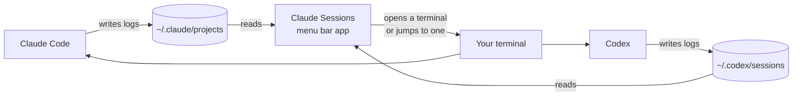
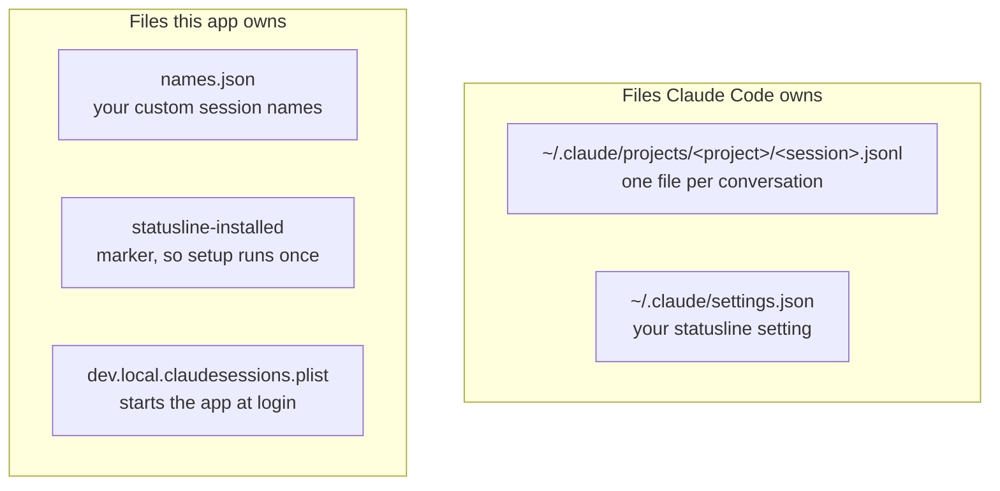
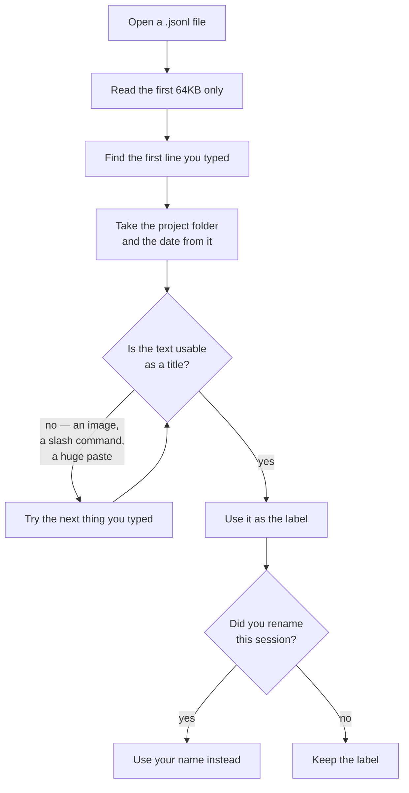
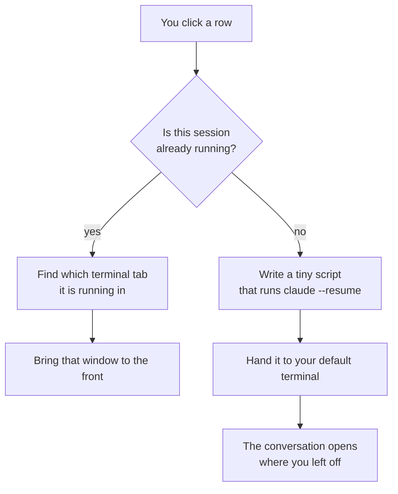
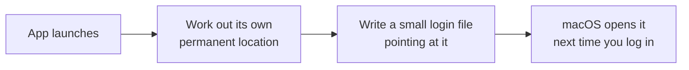
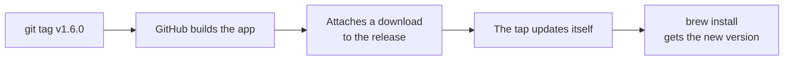
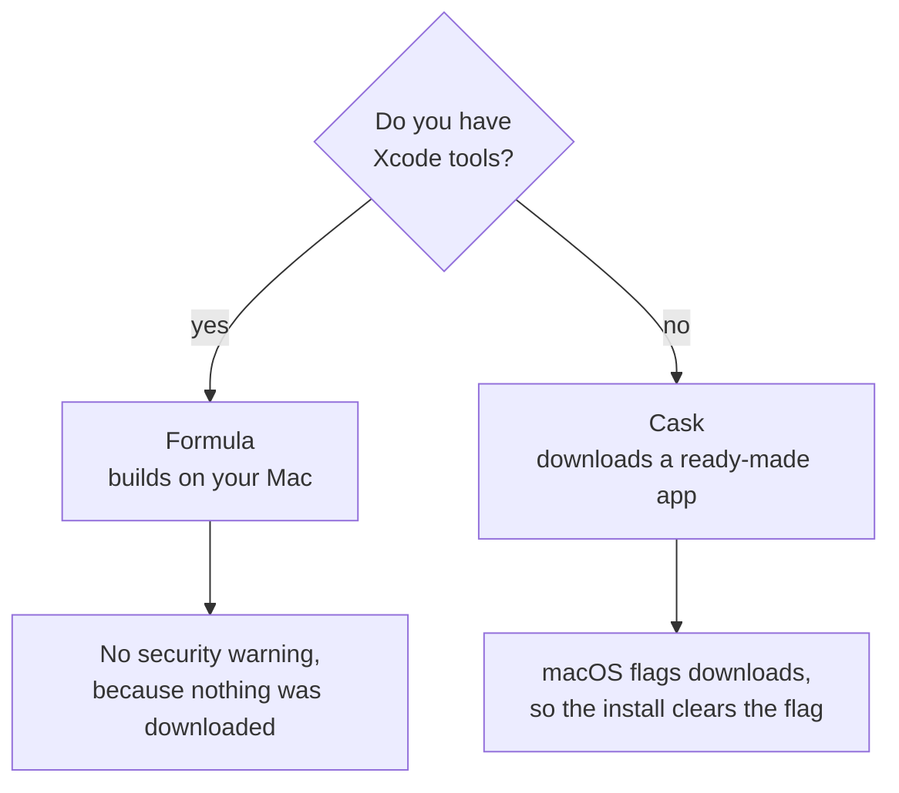

# How it works

Three Swift files, 418 lines. No libraries, no database, no internet.

## The big picture

Claude Code and Codex both write a log of every conversation. This app reads those logs and
gives you a way back into them.



The app only ever **reads**. It never edits or deletes your session logs.

## Where everything lives



Everything in "Files this app owns" sits in `~/Library`. Deleting them resets the app.

## Turning a log file into a row



Only the first 64KB is read because the opening of a conversation is always near the top, and
reading whole files would mean chewing through megabytes to show one line.

## What happens when you click a session



**How it knows a session is already running:** when the app starts a session it passes the
session id on the command line, so it can spot that id in the running process later.

**When it can't tell:** if you started Claude Code yourself, the id isn't there. The app then
only matches by folder, and only if that folder has a single session — otherwise it opens a new
window rather than risk showing you the wrong conversation.

Jumping to an existing window works in Terminal and iTerm2. Other terminals get a new window.

**Skipping permission prompts:** there is a checkbox under the list. Tick it and the resume
command gains `--dangerously-skip-permissions`, so the session runs tools without asking. It is
off until you turn it on, because it is a change to how much the agent can do unattended and
that should be your decision rather than something an install picks for you.

## Starting at login



The "permanent location" step matters. Homebrew installs each version into its own folder and
deletes the old one when you upgrade. Pointing at that folder would break the app on every
upgrade, so it points at Homebrew's fixed shortcut instead.

## Shipping a new version



Pushing a tag is the whole release process. The build works on both Intel and Apple Silicon
Macs, and the build fails on purpose if the Intel half is missing.

## Two ways to install, and why



## Update check

One request to GitHub's releases API on launch, cached for the session. It compares tags
numerically, so 1.10.0 correctly beats 1.9.0. Nothing is downloaded or installed — the app
shows the `brew upgrade` command and Homebrew stays in charge of the actual update.

## What it can't do yet

| | |
|---|---|
| A session with a very long opening | won't appear in the list |
| Jumping to an open window | Terminal and iTerm2 only |
| A session you started by hand, in a folder with several | opens a new window instead |
| Apple security check | not signed up as a paid developer, so macOS doesn't verify it |

## Checking it works

```sh
swift run ClaudeSessions --list
```

Prints every session it can read, with no window. A `!` at the start of a line means that
project folder is gone.
