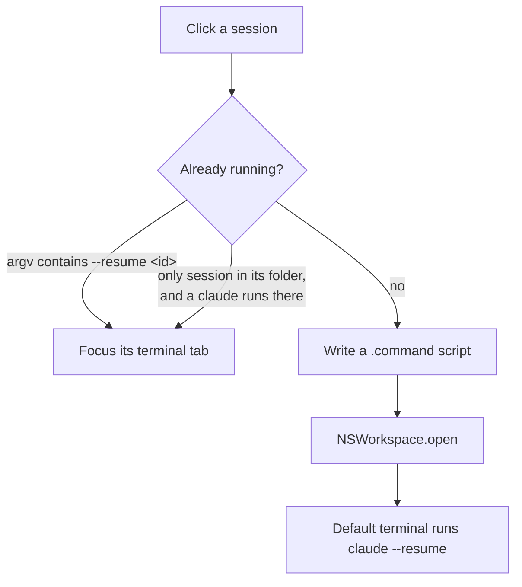

# Architecture

418 lines of Swift in three files. No dependencies, no database, no network. The app is a
reader over files Claude Code already writes, plus two ways of acting on what it reads.

```
Sources/ClaudeSessions/
  Sessions.swift    121   parse the logs, shell helpers, custom names
  App.swift         238   menu bar UI, resume, window focusing, launch at login
  Statusline.swift   59   first-run plugin install
```

## How it finds sessions

Claude Code writes one JSONL file per conversation, in a folder named after the project path:

```
~/.claude/projects/-Users-you-CODE-myapp/<session-id>.jsonl
```

The folder name encodes the directory with `/` replaced by `-`, which is ambiguous for paths
that contain real dashes (`hr-match`). So the folder name is never parsed. The real working
directory is read out of the file contents instead.

Each line is a standalone JSON object. Only records with `"type":"user"` matter — they carry
`cwd`, `sessionId`, `timestamp`, and the message itself.

`loadSessions()` walks every project folder and, for each file:

1. Reads the **first 64KB only**. The opening exchange is always near the top, and reading
   whole files would mean parsing megabytes to display one line. Deepest observed first-user
   record is ~30KB, so the window has roughly 2× headroom. A session whose opening is pushed
   past 64KB by large snapshots would be skipped silently — the known limit of this approach.
2. Takes `cwd` and `sessionId` from the first user record, whatever it says.
3. Walks forward for a *usable* title (see below).
4. Stamps `created` from the first record's timestamp and `modified` from the file's mtime.

Parsing uses `JSONSerialization` and dictionary lookups rather than `Codable`. The records are
heterogeneous and `message.content` is sometimes a string and sometimes an array of blocks;
modelling that in types costs more than it returns for two fields.

### Titles

The opening prompt is usually a good label and sometimes useless. `usableTitle` rejects a
record and lets the caller fall through to the next one when the first line is:

- shorter than 3 characters, or longer than 2000 (a pasted file, not a prompt)
- starting with `<` (system text), `[` (an image-only message), or `/` (a slash command)
- a `Caveat:` preamble

Trailing box-drawing characters are trimmed. Anything over 160 characters is truncated for
display. If nothing usable is found the row shows `(no prompt)`.

A user-supplied name in `~/Library/Application Support/ClaudeSessions/names.json` overrides
the derived title. It's keyed by session id and read on every load.

## How resume works



**Starting a session.** The app writes a short `.command` script to a temp directory and opens
it. macOS hands `.command` files to whatever terminal the user has set as their default, so
Terminal, iTerm, Ghostty and WezTerm all work with no per-terminal integration. The script
checks the directory still exists and that `claude` is on `PATH`, printing an explanation and
holding the window open if not, rather than dying on a bare `command not found`.

**Finding a running session.** A running `claude` doesn't advertise its session id anywhere
queryable — it doesn't hold its JSONL open, so `lsof` can't map process to session. But the
app's own resume script passes `--resume <id>`, so the id is visible in the process arguments:

```
pgrep -x claude  →  ps -o command= -p <pid>  →  match the id  →  ps -o tty= -p <pid>
```

That's exact. When it fails — a session the user started by hand, with no id in argv — the app
falls back to matching the working directory via `lsof -d cwd`, but **only when that folder
holds a single session**. Matching a folder with several sessions would raise a sibling's
window, so it opens a new one instead. A duplicate window is a better failure than silently
surfacing the wrong conversation.

**Focusing the window.** Terminal and iTerm2 both expose a tty per tab through AppleScript, so
the tty from `ps` maps to a window. Both are scripted only if already running, so the app never
launches a terminal just to interrogate it. Any other terminal falls through to a new window.

## Launching at login

`SMAppService.mainApp.register()` is the modern API, and it records the bundle's literal path.
Under a Homebrew formula that path is `…/Cellar/claude-session-manager/1.4.0/…`, which the next
`brew upgrade` deletes — leaving a login item pointing at nothing.

So the app writes its own LaunchAgent instead, rewriting any Cellar path to the version-
independent symlink Homebrew maintains:

```
…/Cellar/claude-session-manager/1.5.0/ClaudeSessions.app
…/opt/claude-session-manager/ClaudeSessions.app
```

It also calls `SMAppService.mainApp.unregister()` on every launch to clean up the pinned entry
that older builds created.

## Statusline install

On first launch only, guarded by a marker file that is written even when the steps fail, so a
broken network can't cause a retry loop on every launch. It shells out to
`claude plugin marketplace add` and `claude plugin install` rather than reimplementing the
plugin system, then points `~/.claude/settings.json` at whichever version resolved. An existing
`statusLine` is copied to `settings.json.claude-sessions-backup` first, and the write is skipped
entirely when the setting already matches.

## The menu bar icon

Drawn in code from a 16×10 grid of `0`/`1` strings — no asset catalog. Cells are 1.5pt so they
land on whole device pixels at 2×, which keeps pixel art from smearing. It's a template image,
so macOS supplies the colour and it follows the light and dark menu bar.

## Shelling out

Several things — process inspection, AppleScript, the plugin install — run through `/bin/zsh -lc`
or `/usr/bin/osascript`. A **login** shell specifically, so `PATH` matches what the user gets in
their terminal; `claude` commonly lives in `~/.local/bin`, which a non-login shell won't see.

## Distribution

```
tag v*  →  release.yml  →  universal build  →  zip attached to the release
                                                     ↓
                              homebrew-tap/bump.yml (polls, or run manually)
                                                     ↓
                                        formula + cask rewritten and pushed
```

Two install paths, deliberately:

- **Formula** — builds from source on the user's machine. Never quarantined, so no Gatekeeper
  warning. Needs the Command Line Tools.
- **Cask** — downloads the prebuilt zip. No Xcode needed, but the app is ad-hoc signed rather
  than notarized, so macOS quarantines it. A `postflight` strips the flag rather than making
  every user run `xattr`.

The release build is **universal** (`arm64` + `x86_64`). GitHub's runners are Apple Silicon, so
without that the cask would ship an arm64-only binary that can't launch on an Intel Mac. The
workflow fails the release if the `x86_64` slice is missing.

The bump workflow lives in the tap repo so it can push with the built-in `GITHUB_TOKEN`. Doing
it from this repo would require a personal access token with write access to every repo the
account owns, stored as a secret.

## Testing

`swift run ClaudeSessions --list` prints every parsed session and exits before any UI or
first-run side effects — the app's one runnable check. Rows whose directory no longer exists
are prefixed `!`.

CI runs it twice on a clean macOS runner: once with no `~/.claude` at all, where it must report
zero sessions rather than crash, and once against a fabricated session file, where the label
must come back out.

## Known limits

| | |
|---|---|
| Sessions whose opening is past 64KB | not listed |
| Window focusing | Terminal and iTerm2 only |
| Hand-started sessions in a multi-session folder | open a new window instead of focusing |
| Process detection | assumes the binary is named `claude` |
| Signing | ad-hoc, not notarized — `spctl` rejects it |
